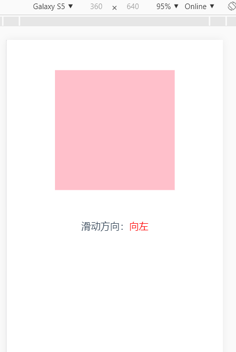

# H5移动端滑动方向 H5-slipDirection

## 安装
```
yarn install
```

### 运行 
```
yarn run serve
```
### 说明
```
适用于vue项目或js项目！~
请在移动端打开或F12移动端模式下打开~
方向只适配了传统四个方向，如果对其他方向有需求可在注释的帮助下对角度微调~
```

### 查看示例
See [demo](https://ggbeng1.github.io/h5-slipDirection/)

### 展示图
